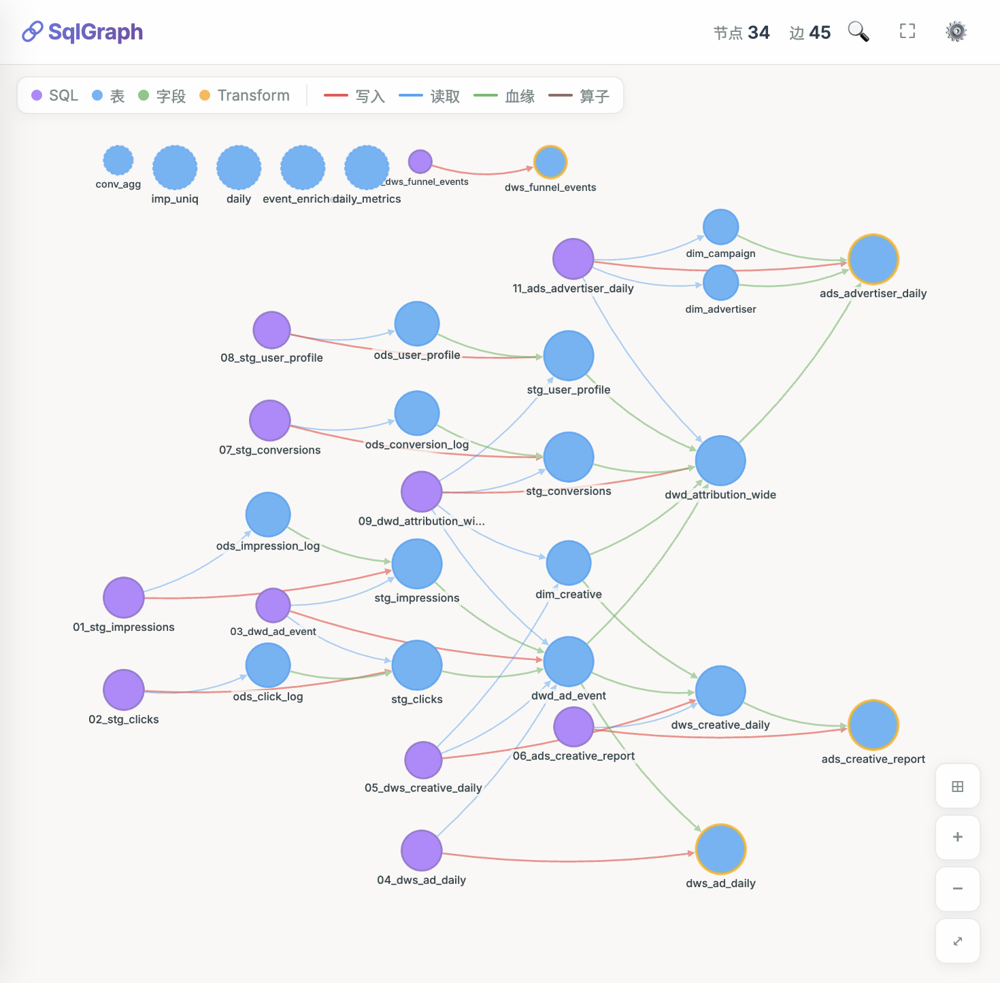
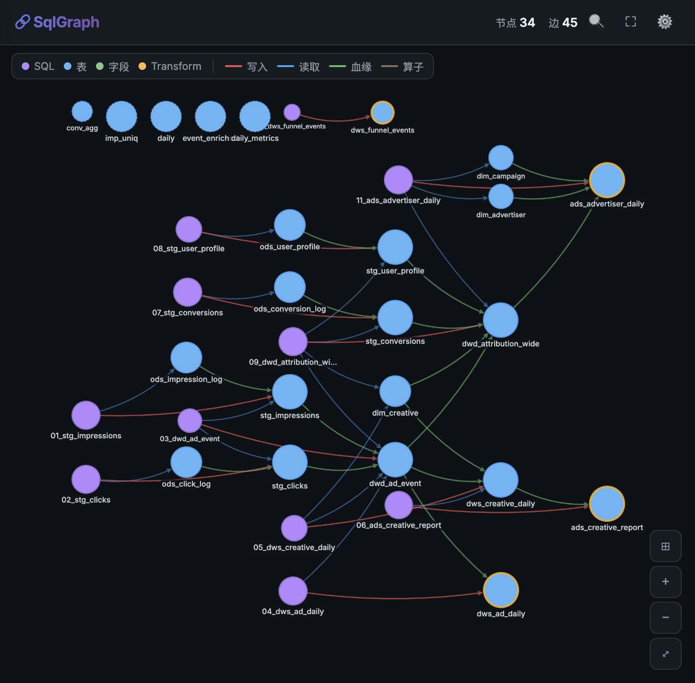
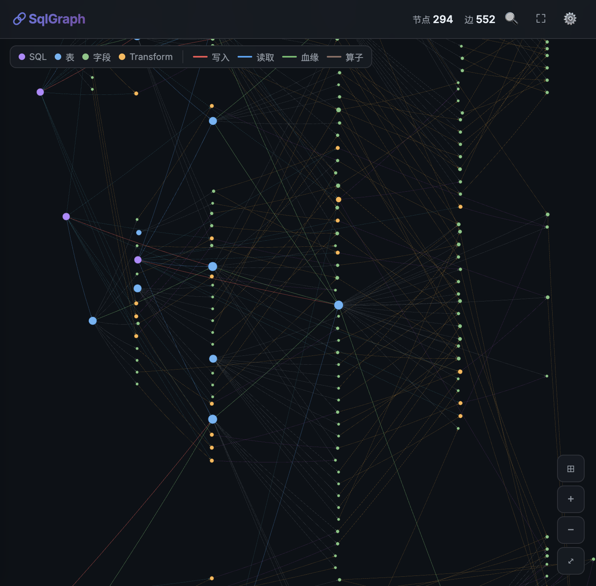

# SqlGraph

[](LICENSE)
[](https://www.python.org/)
[](https://github.com/Liyurun/SqlGraph/actions/workflows/ci.yml)
[](https://github.com/tobymao/sqlglot)
[](CONTRIBUTING.md)

**A SQL-to-Knowledge-Graph engine for modern data warehouses.**

SqlGraph turns scattered warehouse SQL into an interactive knowledge graph of
tables, columns, SQL statements, and reusable transformation logic. It goes
beyond traditional lineage tools: every SQL expression is fingerprinted and
merged only when the output field semantics match, so reused business logic is
visible without collapsing distinct metric aliases.

Use SqlGraph to discover duplicated metrics, audit transformation logic, explain
data flows, and turn your SQL assets into graph-ready knowledge for GraphRAG.

English | [简体中文](README.zh-CN.md)

<p align="center">
  
  
</p>

---

## Why not another lineage tool?

Traditional lineage tools answer:

> Which upstream tables feed this table?

SqlGraph answers:

> Which tables, columns, and transformation logic produced this result?
> Where is the same business logic reused across my warehouse?
> Can I turn SQL pipelines into a graph that downstream AI systems can reason over?

That is why SqlGraph models SQL expressions as reusable, deterministic graph
nodes instead of treating SQL as opaque text.

## What you get

- **Expression-level knowledge graph**:
  SQL files, tables, columns, and transformation logic are all first-class graph
  nodes.

- **Reusable business logic detection**:
  Identical expressions share a 128-bit content fingerprint, and Transform nodes
  merge by `expression fingerprint + output field name`. This keeps
  `SUM(clicks) AS clicks` and `SUM(clicks) AS total_clicks` distinct while
  still collapsing repeated definitions of the same output field.

- **Column-accurate dependencies**:
  Each transformation node is linked to the exact physical columns it reads and
  the output columns it produces. `SUM(impression.ad_id)` and `SUM(click.ad_id)`
  stay distinct.

- **Beautiful interactive visualization**:
  Cytoscape.js layered layouts, dark mode, search, large-graph truncation,
  node-size controls, PNG/SVG export, and a local SQL Playground for instant
  parsing and graph exploration.

- **Graph-ready outputs**:
  Export to HTML, CSV, JSON, GraphRAG payloads, and NetworkX for downstream
  analysis and AI workflows.

## Core capabilities

| Capability | Details |
|---|---|
| **SQL dialects** | Spark / Hive / Presto / BigQuery / MySQL / Postgres and more, powered by [SQLGlot](https://github.com/tobymao/sqlglot) |
| **SQL constructs** | CTEs, sub-queries, `UNION ALL`, `JOIN`s, window functions, `CASE WHEN`, `CAST`, aggregates |
| **Logic identity** | 128-bit expression fingerprints, output-aware Transform merging, and 96-bit table/column IDs for deterministic large-scale graphs |
| **Visualization scale** | Large graphs render the top-1000 nodes first and load more through search |
| **Developer UX** | Simple Python API, Typer CLI, reusable examples, and CI-backed tests |

## Installation

```bash
# from source (recommended while pre-release)
git clone https://github.com/Liyurun/SqlGraph.git
cd SqlGraph
pip install -e .

# or, once published
pip install sqlgraph-lineage
```

Requires Python 3.9+.

## Quick start

### Python API

```python
from sqlgraph import build_graph, to_html

# Parse a folder of SQL and build the graph
graph = build_graph("examples/ads_pipeline/", dialect="spark",
                    schema_path="examples/ads_pipeline/schema.csv")

print(graph.stats())
# {'sql_count': 11, 'table_count': 26, 'column_count': 204,
#  'transform_count': 56, 'edge_count': 552, 'node_count': 297}

# Render an interactive HTML visualization
to_html(graph, output_path="lineage.html", theme="dark", auto_open=True)
```

### CLI

```bash
# Run the built-in AdTech demo and open it in your browser
sqlgraph demo

# Build from your own SQL, emit multiple formats
sqlgraph build ./sql --dialect spark --schema ./schema.csv \
  --format html,csv,json -o ./output

# Build from a table_name/code CSV sample
sqlgraph build examples/df_sample.csv --dialect spark --format html,json

# Start a local SQL Playground
sqlgraph playground

# Just print stats, no files written
sqlgraph stats ./sql --dialect spark
```

## The demo

The repository ships with a complete, realistic **AdTech ETL pipeline** under
[`examples/ads_pipeline/`](examples/ads_pipeline/) — 11 Spark SQL files flowing from raw
ODS logs through staging, DWD, DWS and ADS layers, including multi-CTE joins, `UNION ALL`
funnels and multi-window-function rollups.

Parsed, it produces:

| Metric | Count |
|---|---:|
| SQL files | 11 |
| Tables | 26 |
| Columns | 204 |
| Transformation nodes | 56 |
| Edges | 552 |
| **Total nodes** | **297** |

Run it yourself:

```bash
python examples/ads_pipeline/run_demo.py
```

Switch the view mode to **字段级详情 / column-level** to explore the full expression DAG:

<p align="center">
  
</p>

## How it works

```
 SQL files ──▶ Input ──▶ Parser ──▶ Builder ──▶ Model ──▶ Serialize / Visualize
              (source)  (SQLGlot)   (fusion)  (PropertyGraph)   (HTML/CSV/JSON…)
```

1. **Input** — discover SQL from files, directories, strings, or `table_name,code` CSV files; optionally load a `schema.csv` for column disambiguation.
2. **Parser** — SQLGlot builds the AST; a `ColumnResolver` binds every column to a physical `table.column`. The [expression DAG module](sqlgraph/parser/expr_dag.py) turns each output expression into a fingerprinted logic node.
3. **Builder** — the [graph builder](sqlgraph/builder/graph_builder.py) materializes tables, columns and transformation nodes, deduplicates shared logic by fingerprint plus output field name, and fuses cross-SQL table lineage.
4. **Model** — an in-memory `PropertyGraph` of typed nodes (SQL / Table / Column / Transform) and edges (`reads_from`, `writes_to`, `contains`, `compute_dependency`, `produces`, `table_lineage`, `has_column`).
5. **Serialize / Visualize** — export to CSV, GraphRAG JSON, plain JSON, NetworkX, or an interactive Cytoscape.js HTML page.

See [docs/architecture.md](docs/architecture.md) for the full design.

## Project layout

```
sqlgraph/
├── input/       # SQL sources, CSV schema registry, DataFrame adapter
├── parser/      # SQLGlot-based parsing + expression fingerprint DAG
├── builder/     # PropertyGraph construction & cross-SQL lineage fusion
├── model/       # nodes, edges, PropertyGraph
├── serialize/   # csv / graphrag / json / networkx exporters
├── visualize/   # Cytoscape.js HTML renderer (layered layout, themes)
├── api.py       # build_graph() high-level entry
├── cli.py       # Typer CLI (build / stats / playground / demo)
└── playground.py # local browser playground for ad-hoc SQL exploration
examples/ads_pipeline/   # 11-file AdTech demo + schema.csv
examples/df_sample.csv   # small table_name/code CSV sample
tests/                   # unit + integration tests
```

## Development

```bash
pip install -e ".[all]"
pytest            # run the test suite
```

## Contributing

Issues and PRs are welcome. If SqlGraph is useful to you, a ⭐ helps others discover it.

## License

[Apache 2.0](LICENSE)
